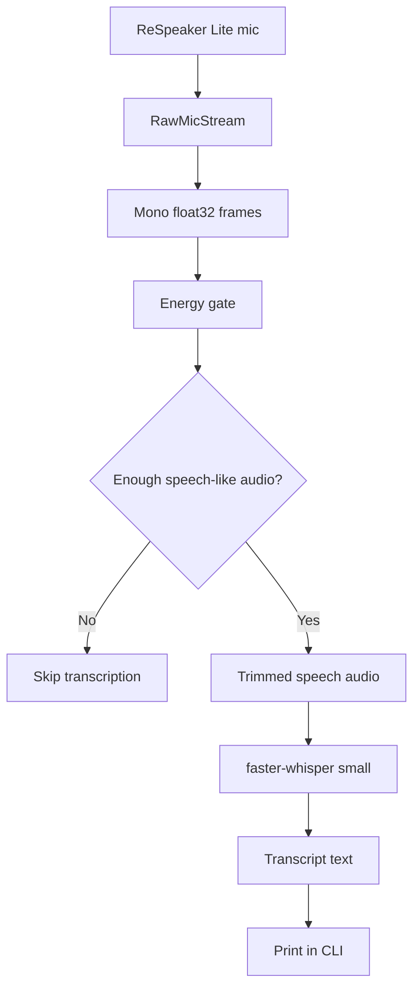
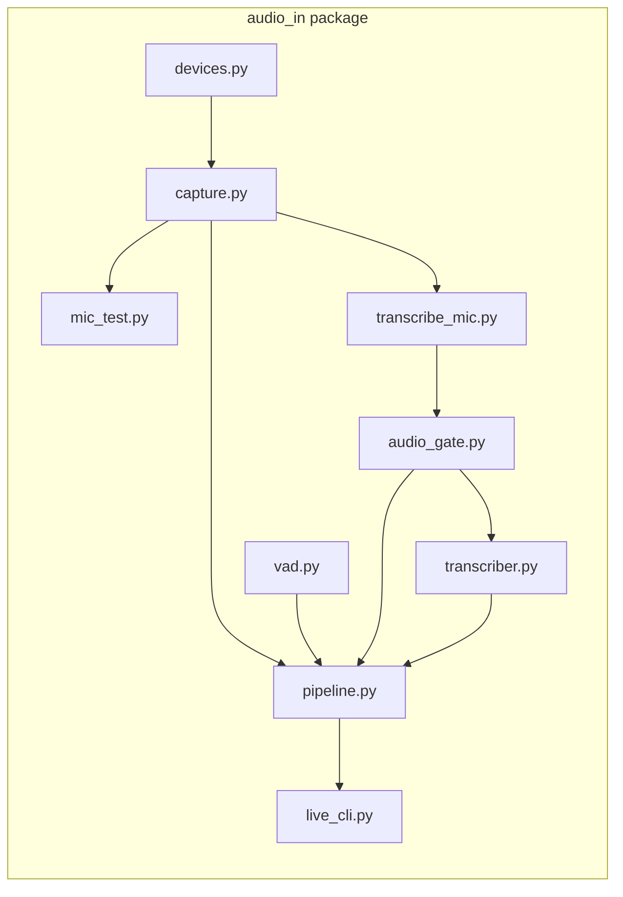
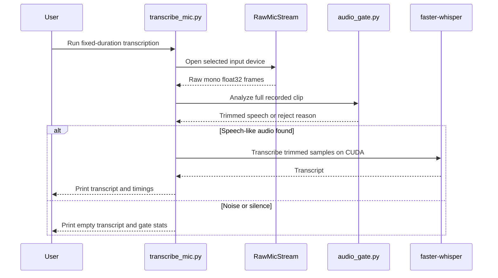
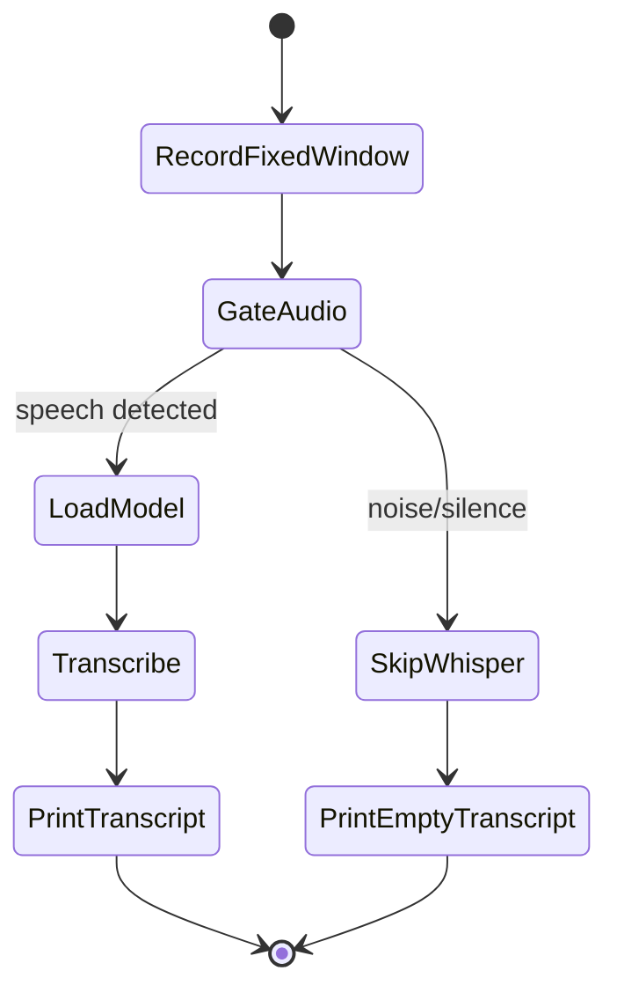
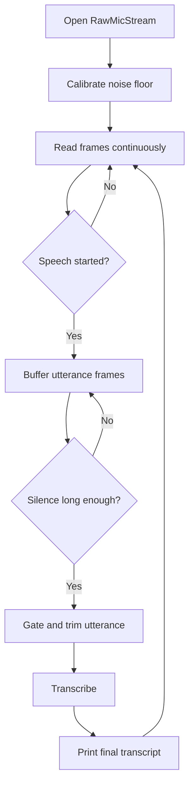

# VS-INTERNSHIP Audio-In Pipeline

This project is building a realtime speech-to-text package named `audio_in`.

The package goal is deliberately narrow:

```text
raw microphone audio in -> completed transcript text out
```

For now, there is no LLM integration. The current focus is to make the microphone capture, speech filtering, and Whisper transcription reliable before building realtime end-of-utterance behavior.

## Target Hardware

- Development machine with CUDA-capable GPU.
- Final deployment target: NVIDIA Jetson Orin Nano running JetPack 6.2.2.
- Microphone: ReSpeaker Lite.
- STT engine: `faster-whisper`, starting with the Whisper `small` model.

The code in `audio_in/` should stay operating-system agnostic. It should not depend on Windows-specific APIs, paths, or device IDs. Audio capture is handled through `sounddevice`, which uses PortAudio underneath and can map to the available audio backend on Linux/Jetson.

## Current Progress

Implemented:

- `audio_in/devices.py`
  - Lists audio input devices.
  - Selects a device by index or name substring.
  - Prefers ReSpeaker-like names when no device is specified.

- `audio_in/capture.py`
  - Provides `RawMicStream`.
  - Captures raw mono `float32` frames.
  - Uses 16 kHz input by default.
  - Keeps OS-specific audio details out of the rest of the package.

- `audio_in/mic_test.py`
  - Records mic audio for 10 seconds by default.
  - Plays the captured audio back.
  - Confirms that the mic path is actually capturing usable sound.

- `audio_in/audio_gate.py`
  - Estimates background noise from raw samples.
  - Detects speech-like frames using energy.
  - Trims audio around speech-like regions.
  - Skips Whisper when the clip looks like silence or random noise.

- `audio_in/transcriber.py`
  - Wraps `faster-whisper`.
  - Uses GPU by default with `device="cuda"`.
  - Accepts raw mono `float32` audio directly.

- `audio_in/transcribe_mic.py`
  - Records fixed-duration mic audio.
  - Applies the audio gate.
  - Runs Whisper transcription.
  - Prints transcript and timing metrics.

- `audio_in/vad.py`
  - Provides first-pass energy VAD.
  - Turns frame-level speech decisions into complete utterance buffers.

- `audio_in/pipeline.py`
  - Coordinates raw mic capture, VAD, utterance buffering, gating, and transcription.

- `audio_in/live_cli.py`
  - Runs the first continuous listening loop.
  - Prints minimal timestamped transcript lines after silence ends an utterance.

Not implemented yet:

- Partial transcripts.
- Transcript-aware end-of-utterance detection beyond simple silence.
- Jetson install and benchmark notes.

## Pipeline Overview

Mermaid diagrams render on GitHub. In VS Code, install the recommended
`Markdown Preview Mermaid Support` extension, then open Markdown preview with
`Ctrl+Shift+V`.



## Package Boundaries



The CLI files are thin test runners. The real reusable parts are:

- `RawMicStream` in `capture.py`
- `gate_audio` in `audio_gate.py`
- `WhisperTranscriber` in `transcriber.py`

## Current Test Flow



## How To Run

List available input devices:

```powershell
python -m audio_in.mic_test --list
```

Record 10 seconds from the mic and play it back:

```powershell
python -m audio_in.mic_test --device 54
```

Record 10 seconds and transcribe:

```powershell
python -m audio_in.transcribe_mic --device 54 --seconds 10
```

Continuously listen and print a transcript after speech ends:

```powershell
python -m audio_in.live_cli --device 54
```

Show calibration, rejection, and timing diagnostics while tuning:

```powershell
python -m audio_in.live_cli --device 54 --verbose
```

Bypass the energy gate for comparison:

```powershell
python -m audio_in.transcribe_mic --device 54 --seconds 10 --no-gate
```

Direct script execution also works for VS Code Code Runner:

```powershell
python audio_in\mic_test.py --device 54
python audio_in\transcribe_mic.py --device 54 --seconds 10
```

The `54` device index is only an example from the current development machine. Do not hard-code it in the package. On another machine or on Jetson, run `--list` and select the correct ReSpeaker Lite device there.

## Current Transcription Behavior

The system currently records a fixed window, then transcribes after recording ends.
The continuous CLI now also supports a simple realtime loop based on silence after speech.



The fixed-window command is still useful as a controlled test step so microphone capture, GPU Whisper, and hallucination filtering can be debugged separately.

## Realtime Loop



## Next Step

The next engineering step is tuning the realtime loop:

- Reduce false speech starts from noise.
- Reduce Whisper hallucinations after weak utterances.
- Tune `--threshold-multiplier`, `--min-threshold`, and `--end-silence-seconds`.
- Add transcript-aware end-of-utterance logic after silence-based detection feels stable.

## Design Rules

- Keep `audio_in/` as the real project package.
- Do not copy architecture from older exploratory scripts outside `audio_in/`.
- Keep raw mic capture separate from transcription.
- Keep CLI runners thin.
- Keep GPU transcription as the default path.
- Avoid sending random noise or silence to Whisper.
- Avoid sending Whisper hallucinations as real transcript text.
- Prefer 16 kHz mono `float32` internally.
- Make device selection configurable; do not hard-code local device IDs.

## Updating This README

Keep this README up to date as the project moves:

- Add new modules to **Current Progress** when they are implemented.
- Update Mermaid diagrams when the pipeline changes.
- Move completed items out of **Not implemented yet**.
- Add new run commands when new CLIs are created.
- Add Jetson-specific setup notes once the package is tested on JetPack 6.2.2.
